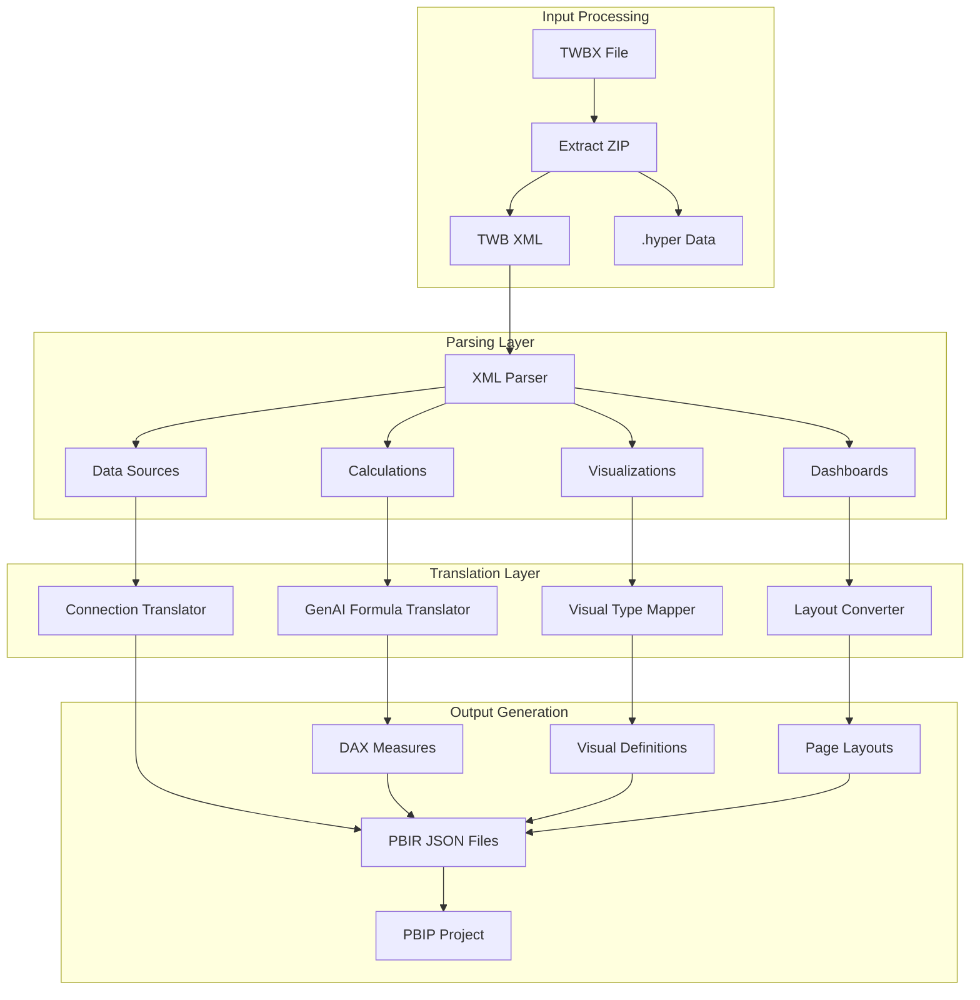

# Tableau to Power BI Conversion Tool

## Important Caveat on "100% Accuracy"

Before diving in, I need to be direct: **100% accuracy for all cases is not achievable** due to fundamental platform differences. Commercial tools like BIChart and Pulse Convert claim 70-98% accuracy after years of development. The remaining gaps require manual review. This plan maximizes automation but will require validation for edge cases.

**Key incompatibilities:**

- Tableau's table calculations have different semantics than DAX window functions
- Some Tableau visual types have no Power BI equivalent
- LOD expressions translate to DAX but may behave differently with complex filter contexts
- Tableau parameters work differently than Power BI What-If parameters

---

## Architecture Overview



---

## Component Breakdown

### 1. TWBX Parser Module

**Libraries:** `tableau-parser`, `tableaudocumentapi`, `lxml`

Extract and parse the Tableau workbook structure:

```python
# Key data structures to extract:
- datasources: connections, tables, joins, custom SQL
- calculated_fields: name, formula, data_type
- parameters: name, type, current_value, allowable_values
- worksheets: name, marks, rows/columns, filters
- dashboards: layout, objects, actions
```

### 2. Formula Translation Engine (GenAI-Assisted)

This is where GenAI provides the most value. The translation requires:

| Tableau Construct | DAX Equivalent | Complexity |

|---|---|---|

| SUM, AVG, COUNT | SUM, AVERAGE, COUNT | Simple |

| IF/CASE/IIF | IF, SWITCH | Simple |

| FIXED LOD | CALCULATE + ALLEXCEPT | Medium |

| INCLUDE LOD | AVERAGEX + SUMMARIZE | Medium |

| EXCLUDE LOD | CALCULATE + REMOVEFILTERS | Medium |

| RUNNING_SUM | WINDOW or iterator patterns | Hard |

| WINDOW_AVG | WINDOW function | Hard |

| INDEX(), FIRST(), LAST() | Complex iterator patterns | Hard |

| Nested table calcs | May require complete redesign | Very Hard |

**GenAI Role:**

- Parse Tableau formula AST
- Generate equivalent DAX with context
- Handle edge cases and nested expressions
- Explain translations that need manual review

### 3. Visual Type Mapper

| Tableau Visual | Power BI Visual | Notes |

|---|---|---|

| Bar Chart | Bar Chart | Direct mapping |

| Line Chart | Line Chart | Direct mapping |

| Scatter Plot | Scatter Chart | Direct mapping |

| Map | Map/Azure Map | Check for custom geocoding |

| Treemap | Treemap | Direct mapping |

| Dual Axis | Combo Chart | Partial - different behavior |

| Gantt | Gantt (custom visual) | Requires marketplace visual |

| Lollipop | Custom visual needed | No native equivalent |

### 4. PBIR Output Generator

**Libraries:** `pbir_tools` or custom JSON generation

Generate Power BI project structure:

```
MyReport.pbip/
├── definition.pbir
├── definition/
│   ├── pages/
│   │   └── page1/
│   │       ├── page.json
│   │       └── visuals/
│   │           └── visual1.json
│   └── report.json
├── Model/
│   ├── model.bim (Tabular Model)
│   └── expressions.tmdl
└── DataModel/
```

---

## Where GenAI Provides Maximum Value

1. **Formula Translation (Primary Use Case)**

   - Parse Tableau calculation syntax
   - Generate semantically equivalent DAX
   - Handle context differences between platforms
   - Flag formulas that need human review

2. **Complex Logic Understanding**

   - Nested LOD expressions
   - Table calculations with custom addressing
   - Parameter-driven calculations

3. **Data Source Query Translation**

   - Custom SQL to Power Query M
   - Join logic preservation

4. **Validation and Documentation**

   - Generate validation reports
   - Document translation decisions
   - Flag potential accuracy issues

---

## Implementation Strategy

### Phase 1: Parser Foundation

- Extract TWBX contents
- Parse TWB XML into structured Python objects
- Build comprehensive data model for all Tableau components

### Phase 2: Simple Translations

- Direct visual mappings
- Simple formula translations (aggregations, basic IF)
- Data source connection translation

### Phase 3: GenAI Formula Engine

- Integrate LLM for formula translation
- Build prompt templates for each formula type
- Implement validation and testing framework

### Phase 4: Advanced Features

- Table calculations
- Complex LOD expressions
- Dashboard actions and interactivity
- Parameters

### Phase 5: PBIR Generation

- Generate valid PBIR JSON structure
- Create semantic model (DAX measures)
- Package as PBIP project

---

## Key Files to Create

- `twbx_parser.py` - Extract and parse Tableau files
- `formula_translator.py` - GenAI-powered formula translation
- `visual_mapper.py` - Chart type mapping
- `pbir_generator.py` - Power BI output generation
- `validation_report.py` - Generate accuracy reports
- `main.py` - CLI orchestration

---

## Limitations and Manual Review Required

Even with this tool, you will need manual review for:

1. **Table calculations** with complex addressing (Compute Using settings)
2. **Custom visuals** not available in Power BI
3. **Dashboard actions** (filter, highlight, URL actions)
4. **Performance optimization** of converted DAX
5. **Row-level security** policies
6. **Data extract refresh schedules**

---

## Recommended Approach

Given 50+ enterprise workbooks with advanced calculations:

1. Build the converter tool as outlined
2. Run automated conversion on all workbooks
3. Generate validation report highlighting:

   - Successfully converted components
   - Components needing manual review
   - Unsupported features

4. Prioritize manual review for business-critical reports
5. Iterate on the tool to handle common edge cases